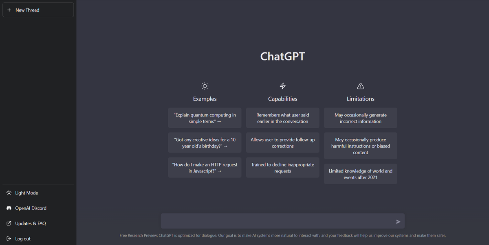

## Getting Started

First, install the dependencies:

```bash
npm install
# or
yarn install
# or
pnpm install
# or
bun install

Then, run the development server:

```bash
npm run dev
# or
yarn dev
# or
pnpm dev
# or
bun dev
```

Open [http://localhost:3000](http://localhost:3000) with your browser to see the result.


## Development Inspiration

This project was inspired and developed based on the version of ChatGPT shown in the image above, highlighting its examples, capabilities, and limitations.


## Features
 - Start a new conversation
 - Store previous conversations
 - Edit conversation titles
 - Delete a single conversation
 - Delete all conversations
 - Fully responsive design
 These features aim to replicate and enhance the user experience similar to ChatGPT, with a focus on usability and accessibility across different devices.

